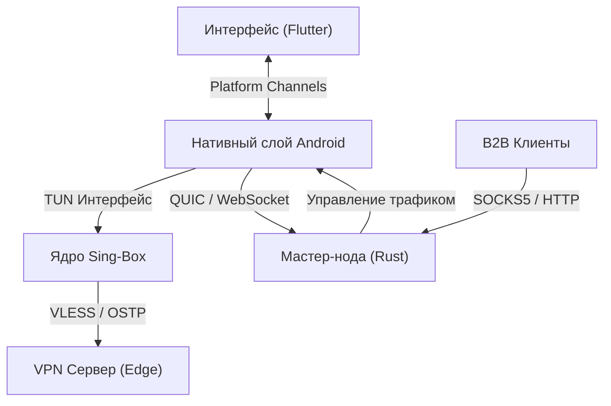

# Архитектура системы ByteAway

ByteAway представляет собой распределенную сетевую платформу, объединяющую возможности защищенного VPN-клиента и сети резидентных прокси. Система позволяет пользователям обходить интернет-блокировки, используя современные обфусцированные протоколы, и добровольно предоставлять часть своего трафика B2B-клиентам в обмен на внутренний баланс.

## Обзор компонентов системы

Архитектура системы включает в себя три ключевых элемента:
1. **Мобильный клиент (Android/Flutter)**: Конечная точка пользователя, выполняющая функции VPN-клиента и прокси-узла (Node).
2. **Мастер-нода (Rust)**: Координирующий сервер, управляющий пулом мобильных узлов, биллингом и авторизацией.
3. **Гейтвей прокси (SOCKS5/HTTP)**: Входит в состав Мастер-ноды и отвечает за маршрутизацию входящего трафика B2B-клиентов на активные мобильные узлы.

### Схема взаимодействия компонентов

---

## Подробный анализ компонентов

### 1. Клиентское приложение

Клиент состоит из кроссплатформенного интерфейса на **Flutter** и нативного сетевого слоя на **Kotlin** с интеграцией Go-библиотеки **Sing-Box**.

- **Слой представления (Flutter)**: Реализует пользовательский интерфейс на базе Material 3 и эффектов Glassmorphism. Управляет состоянием через Cubit/Bloc.
- **Слой операционной системы (Android Kotlin)**: Реализует `VpnService` и `Foreground Service`. Отвечает за выделение сетевого интерфейса TUN (IP 172.19.0.1) и управление жизненным циклом фоновых соединений.
- **Сетевое ядро (Sing-Box Go)**: Скомпилировано в `.aar` библиотеку (`boxwrapper`). Обеспечивает низкоуровневую обработку трафика и маршрутизацию.

### 2. Мастер-нода

Серверная часть спроектирована на языке программирования **Rust** с использованием асинхронной среды исполнения **Tokio** и веб-фреймворка **Axum**.

- **Управление узлами**: Поддерживает постоянные соединения с мобильными узлами по протоколам QUIC и WebSocket.
- **Маршрутизация трафика**: Принимает трафик от B2B-клиентов через SOCKS5-прокси и направляет его через мультиплексированные каналы yamux на телефоны пользователей.
- **Хранение данных**: Использует СУБД PostgreSQL для долгосрочного хранения учетных записей и истории баланса, а также Redis для кэширования активных соединений и промежуточной статистики.

---

## Жизненный цикл трафика

Система поддерживает два независимых режима работы, которые могут быть активны одновременно:

### Режим VPN (Туннелирование)
1. Пользователь активирует VPN в интерфейсе приложения.
2. Flutter передает команду через `MethodChannel` в нативный слой Kotlin.
3. Код на Kotlin вызывает API `VpnService.Builder`, настраивает IP-адресацию (`172.19.0.1`) и применяет правила исключений Split-Tunneling.
4. Весь трафик устройства направляется в выделенный TUN-интерфейс, который напрямую считывается и обрабатывается ядром `sing-box`.
5. Трафик инкапсулируется в защищенный протокол (VLESS + XTLS-Reality или OSTP) и отправляется на выходные узлы (Edge Servers).

### Режим Ноды (Proxy Node)
1. Пользователь дает согласие на использование своего устройства в качестве прокси-сервера.
2. Нативный слой Kotlin инициирует фоновое соединение (QUIC или WebSocket) с Мастер-нодой.
3. Мастер-нода регистрирует данный узел в Redis и включает его в пул доступных адресов.
4. Когда B2B-клиент отправляет запрос на SOCKS5-порт Мастер-ноды, запрос пересылается через открытый мультиплексированный канал на телефон пользователя.
5. Приложение ByteAway принимает этот запрос, отправляет его от имени устройства в открытый интернет, получает ответ и возвращает его B2B-клиенту.

---

## Технологии защиты от блокировок

Для обеспечения максимальной стабильности соединения используются следующие технологии:
- **VLESS с XTLS-Reality**: Протокол маскирует VPN-соединение под легитимный HTTPS трафик популярных сайтов, исключая возможность его обнаружения системами DPI (Deep Packet Inspection).
- **OSTP (Ospab Stealth Transport Protocol)**: Кастомная разработка для дополнительного шифрования трафика в закрытых корпоративных или государственных сетях.
- **Yamux (Yet Another Multiplexer)**: Снижает накладные расходы на установку новых соединений, позволяя передавать множество виртуальных запросов внутри одного открытого физического канала.
